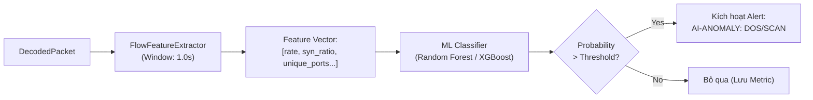

# ĐẶC TẢ KIẾN TRÚC TRÍ TUỆ NHÂN TẠO (AI SPECIFICATION) – FLOW ANOMALY WORKER

- **Module:** `nids`
- **Feature:** `core_engine` (Phân hệ AI Traffic Worker)
- **Mục tiêu:** Phát hiện các cuộc tấn công không dựa vào chuỗi cố định (signature-less attacks) như SYN Flood DoS/DDoS, Port Scanning và Data Exfiltration thông qua phân tích đặc trưng luồng (Flow Features).

---

## 1. MÔ HÌNH HỌC MÁY & BÀI TOÁN (ML PROBLEM FORMULATION)

### 1.1. Loại bài toán

- **Bài toán:** Phát hiện bất thường mạng (Network Anomaly Detection).
- **Phương pháp tiếp cận:**
  - _Giai đoạn 1 (Baseline - Heuristic Flow Stats)_: Trích xuất chỉ số thống kê theo cửa sổ thời gian trượt (Sliding Time Window $T = 1.0$ giây) dựa trên `feature_extractor.py`.
  - _Giai đoạn 2 (Machine Learning Inference)_: Sử dụng mô hình phân loại nhị phân/đa lớp nhẹ (Random Forest / XGBoost / Isolation Forest) để gán nhãn luồng mạng `NORMAL`, `DOS_SYN_FLOOD`, `PORT_SCAN`.

---

## 2. BỘ ĐẶC TRƯNG LUỒNG MẠNG (NETWORK FLOW FEATURE SET)

Được trích xuất trực tiếp từ các gói tin bóc tách bởi `packet_decoder.py`:

| Tên Feature        | Kiểu    | Ý nghĩa an ninh mạng                            | Dấu hiệu tấn công                                           |
| :----------------- | :------ | :---------------------------------------------- | :---------------------------------------------------------- |
| `packet_rate`      | `float` | Số gói tin/giây gửi từ một `src_ip`             | Tăng đột biến khi có DoS / Brute-force                      |
| `byte_rate`        | `float` | Tổng dung lượng bytes/giây từ `src_ip`          | Băng thông bất thường                                       |
| `syn_ratio`        | `float` | Tỷ lệ cờ SYN trên tổng số gói TCP               | $\approx 1.0 \rightarrow$ Tấn công TCP SYN Flood            |
| `rst_ratio`        | `float` | Tỷ lệ cờ RST nhận được                          | Quét cổng trúng các port đóng                               |
| `unique_dst_ports` | `int`   | Số cổng đích khác nhau mà 1 IP gọi tới trong 1s | $> 20 \rightarrow$ Dấu hiệu Nmap Port Scan                  |
| `avg_packet_size`  | `float` | Kích thước gói tin trung bình                   | Gói tin siêu nhỏ (SYN Flood) hoặc cực lớn (Buffer Overflow) |

---

## 3. FLOW FEATURE EXTRACTOR PIPELINE

---

## 4. QUY TRÌNH HUẤN LUYỆN VÀ ĐÁNH GIÁ (DATASET & EVALUATION)

- **Tập dữ liệu chuẩn huấn luyện:** CICIDS2017 / NSL-KDD (các tập dataset học thuật chuẩn quốc tế cho NIDS).
- **Metric đánh giá:**
  - F1-Score $\ge 0.95$ cho lớp tấn công DoS/Scan.
  - False Positive Rate (Tỷ lệ báo động nhầm) $< 1\%$ để tránh làm phiền quản trị viên mạng.
- **Latency Budget:** Thời gian trích xuất và suy luận (Inference Time) cho 1 luồng $< 5$ms.
