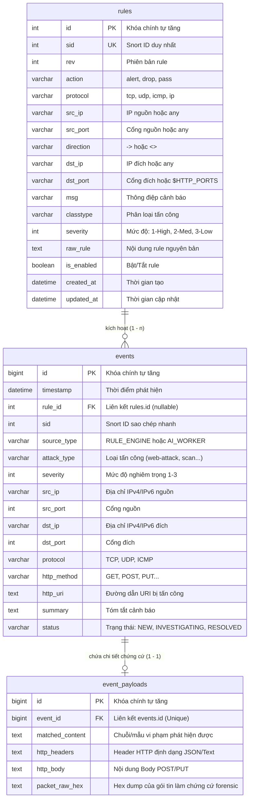

# THIẾT KẾ KIẾN TRÚC DỮ LIỆU (DATABASE SCHEMA) – HYBRID NIDS CORE ENGINE

- **Module:** `nids`
- **Feature:** `core_engine`
- **Hệ quản trị CSDL:** MySQL 8.0+ (Docker Container) / SQLAlchemy 2.0 ORM
- **Quy ước đặt tên:** `snake_case`, Primary Key `id`, lưu trữ thời gian UTC chuẩn ISO 8601.

---

## 1. SƠ ĐỒ THỰC THỂ QUAN HỆ (MERMAID ERD)

---

## 2. ĐẶC TẢ CHI TIẾT CÁC BẢNG (TABLE SPECIFICATIONS)

### 2.1. Bảng `rules` (Tập luật phát hiện tĩnh)

Lưu trữ toàn bộ luật phát hiện đã được parse từ các file `.rules` (ví dụ: `web_attacks.rules`, `network_scans.rules`).

| Tên cột      | Kiểu dữ liệu   | Ràng buộc                   | Mô tả                                            |
| :----------- | :------------- | :-------------------------- | :----------------------------------------------- |
| `id`         | `INT`          | PK, AUTO_INCREMENT          | Định danh bản ghi nội bộ                         |
| `sid`        | `INT`          | UNIQUE, NOT NULL, INDEX     | Mã nhận dạng luật (Snort ID) duy nhất            |
| `rev`        | `INT`          | DEFAULT 1                   | Phiên bản cập nhật của luật                      |
| `action`     | `VARCHAR(10)`  | DEFAULT 'alert'             | Hành động xử lý (alert, drop, log)               |
| `protocol`   | `VARCHAR(10)`  | NOT NULL                    | Giao thức áp dụng (tcp, udp, icmp, ip)           |
| `src_ip`     | `VARCHAR(50)`  | DEFAULT 'any'               | Dải IP nguồn áp dụng                             |
| `src_port`   | `VARCHAR(20)`  | DEFAULT 'any'               | Cổng nguồn áp dụng                               |
| `direction`  | `VARCHAR(5)`   | DEFAULT '->'                | Hướng lưu lượng (`->` một chiều, `<>` hai chiều) |
| `dst_ip`     | `VARCHAR(50)`  | DEFAULT 'any'               | Dải IP đích áp dụng                              |
| `dst_port`   | `VARCHAR(20)`  | DEFAULT 'any'               | Cổng đích áp dụng (hỗ trợ `$HTTP_PORTS`)         |
| `msg`        | `VARCHAR(255)` | NOT NULL                    | Thông điệp hiển thị khi vi phạm                  |
| `classtype`  | `VARCHAR(50)`  | NULL                        | Nhóm phân loại tấn công                          |
| `severity`   | `INT`          | DEFAULT 2                   | 1: High, 2: Medium, 3: Low                       |
| `raw_rule`   | `TEXT`         | NOT NULL                    | Chuỗi cấu hình luật gốc                          |
| `is_enabled` | `BOOLEAN`      | DEFAULT TRUE                | Trạng thái kích hoạt trong engine                |
| `created_at` | `DATETIME`     | DEFAULT CURRENT_TIMESTAMP   | Thời điểm thêm luật                              |
| `updated_at` | `DATETIME`     | ON UPDATE CURRENT_TIMESTAMP | Thời điểm sửa đổi luật                           |

- **Chỉ mục (Indexes):**
  - `idx_rules_sid`: Tìm kiếm nhanh theo `sid`.
  - `idx_rules_proto_port`: Tối ưu hóa so khớp nhanh theo `(protocol, dst_port)`.

---

### 2.2. Bảng `events` (Nhật ký cảnh báo sự kiện an ninh mạng)

Mỗi gói tin vi phạm hoặc luồng bất thường do AI phát hiện sẽ tạo ra một bản ghi cảnh báo.

| Tên cột       | Kiểu dữ liệu   | Ràng buộc                             | Mô tả                                                  |
| :------------ | :------------- | :------------------------------------ | :----------------------------------------------------- |
| `id`          | `BIGINT`       | PK, AUTO_INCREMENT                    | Mã sự kiện định danh toàn cục                          |
| `timestamp`   | `DATETIME`     | NOT NULL, INDEX                       | Thời điểm bắt được gói tin vi phạm                     |
| `rule_id`     | `INT`          | FK $\rightarrow$ `rules.id`, NULLABLE | Khóa ngoại trỏ đến luật vi phạm (NULL nếu do AI)       |
| `sid`         | `INT`          | NULLABLE                              | Snort ID lưu dự phòng để truy vấn nhanh không cần JOIN |
| `source_type` | `VARCHAR(20)`  | DEFAULT 'RULE_ENGINE'                 | Nguồn phát hiện: `RULE_ENGINE` hoặc `AI_WORKER`        |
| `attack_type` | `VARCHAR(100)` | NOT NULL                              | Tên loại tấn công (ví dụ: `web-application-attack`)    |
| `severity`    | `INT`          | NOT NULL                              | Mức độ cảnh báo (1: Cao, 2: Trung bình, 3: Thấp)       |
| `src_ip`      | `VARCHAR(45)`  | NOT NULL, INDEX                       | Địa chỉ IP kẻ tấn công (hỗ trợ cả IPv4 và IPv6)        |
| `src_port`    | `INT`          | NULLABLE                              | Cổng mạng nguồn                                        |
| `dst_ip`      | `VARCHAR(45)`  | NOT NULL                              | Địa chỉ IP máy nạn nhân/máy chủ bảo vệ                 |
| `dst_port`    | `INT`          | NULLABLE, INDEX                       | Cổng dịch vụ đích                                      |
| `protocol`    | `VARCHAR(10)`  | NOT NULL                              | Giao thức mạng (TCP, UDP, ICMP)                        |
| `http_method` | `VARCHAR(10)`  | NULLABLE                              | Phương thức HTTP (GET, POST...) nếu có                 |
| `http_uri`    | `TEXT`         | NULLABLE                              | Đường dẫn tài nguyên bị khai thác                      |
| `summary`     | `TEXT`         | NOT NULL                              | Chi tiết tóm tắt về sự kiện cảnh báo                   |
| `status`      | `VARCHAR(20)`  | DEFAULT 'NEW'                         | Trạng thái xử lý: `NEW`, `RESOLVED`, `IGNORED`         |

- **Chỉ mục (Indexes):**
  - `idx_events_timestamp`: Tối ưu truy vấn lịch sử cảnh báo theo mốc thời gian (sắp xếp giảm dần).
  - `idx_events_src_ip`: Thống kê tần suất tấn công từ một IP cụ thể (chống DoS/Scan).
  - `idx_events_status`: Lọc danh sách cảnh báo chưa xử lý (`NEW`).

---

### 2.3. Bảng `event_payloads` (Chứng cứ kỹ thuật số - Forensic Evidence)

Tách rời phần payload chi tiết sang bảng riêng để giữ cho bảng `events` nhẹ, truy vấn dashboard tải trang siêu nhanh.

| Tên cột           | Kiểu dữ liệu | Ràng buộc                              | Mô tả                                                     |
| :---------------- | :----------- | :------------------------------------- | :-------------------------------------------------------- |
| `id`              | `BIGINT`     | PK, AUTO_INCREMENT                     | Khóa chính                                                |
| `event_id`        | `BIGINT`     | FK $\rightarrow$ `events.id`, NOT NULL | Mã liên kết 1-1 với sự kiện cảnh báo                      |
| `matched_content` | `TEXT`       | NULLABLE                               | Đoạn chuỗi độc hại cụ thể bị bắt gặp                      |
| `http_headers`    | `TEXT`       | NULLABLE                               | Toàn bộ header HTTP tại thời điểm tấn công                |
| `http_body`       | `TEXT`       | NULLABLE                               | Toàn bộ payload body của HTTP request                     |
| `packet_raw_hex`  | `TEXT`       | NULLABLE                               | Dạng chuỗi Hex dump phục vụ phân tích gói tin cấp độ thấp |

---

## 3. CHIẾN LƯỢC TOÀN VẸN VÀ TỐI ƯU HÓA (OPTIMIZATION STRATEGY)

1. **Phân tách Dữ liệu Nóng/Lạnh (Hot/Cold Data Segregation)**: Bảng `events` chỉ chứa metadata phục vụ query thống kê. Nội dung nặng (`matched_content`, `packet_raw_hex`) đưa vào `event_payloads` và chỉ nạp lên khi SOC Analyst bấm xem chi tiết sự kiện.
2. **Schema Migration & Resilience**: Hàm `ensure_database_exists()` trong `services/database/__init__.py` tự động chạy kiểm tra và tạo database `nids_db` khi ứng dụng khởi động lần đầu, chống crash nếu MySQL mới dựng từ container.
