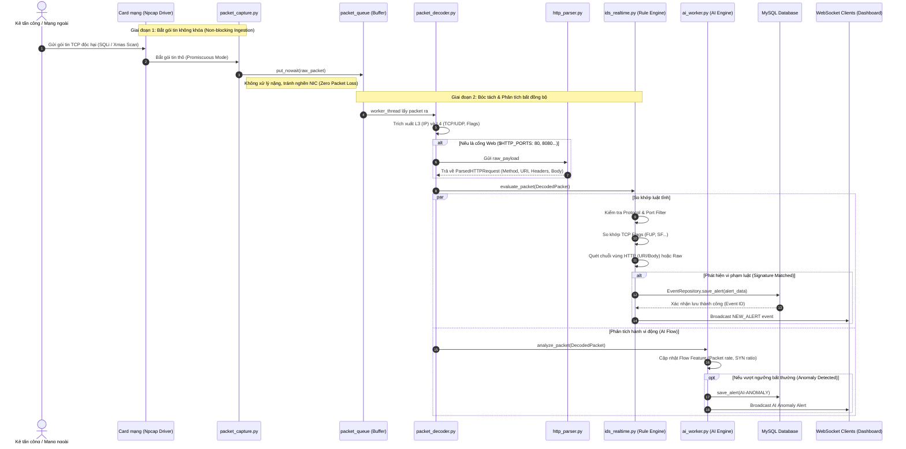
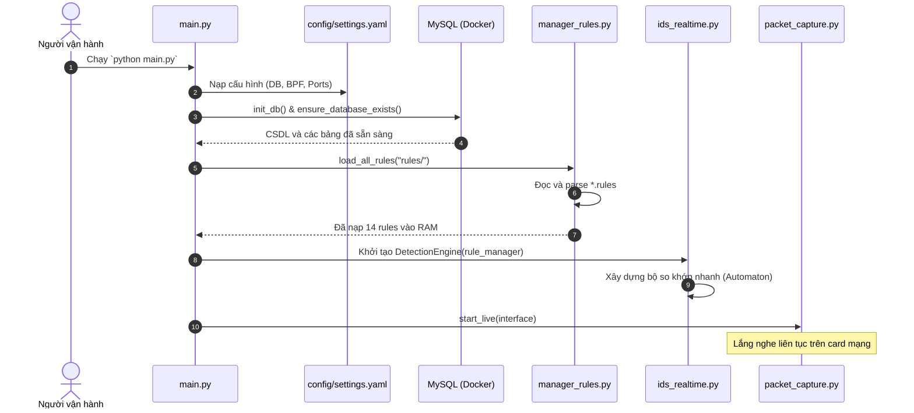

# SƠ ĐỒ TUẦN TỰ HỆ THỐNG (SEQUENCE DIAGRAM) – HYBRID NIDS CORE ENGINE

- **Module:** `nids`
- **Feature:** `core_engine`

---

## 1. LUỒNG XỬ LÝ GÓI TIN THỜI GIAN THỰC (REAL-TIME DETECTION PIPELINE)

Sơ đồ mô tả hành trình từ lúc gói tin chạm Card mạng qua hai tầng phân tích (Rule Engine & AI) đến khi lưu MySQL và bắn WebSocket Alert ra Dashboard:

---

## 2. LUỒNG KHỞI ĐỘNG HỆ THỐNG (SYSTEM BOOTSTRAP SEQUENCE)

